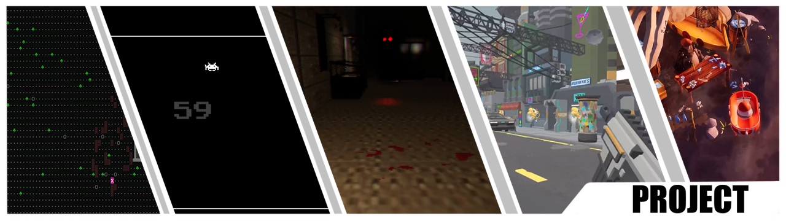
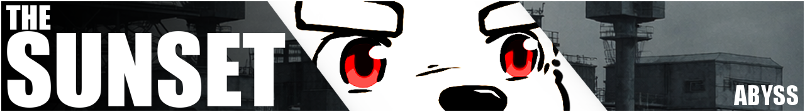
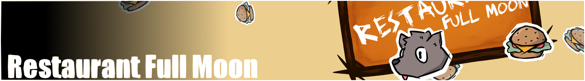
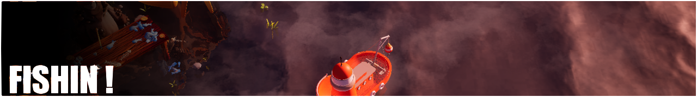
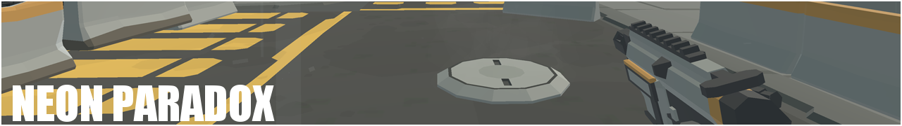
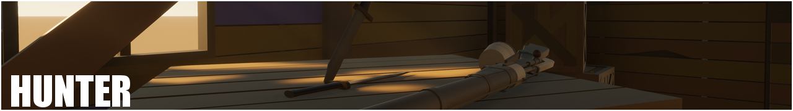
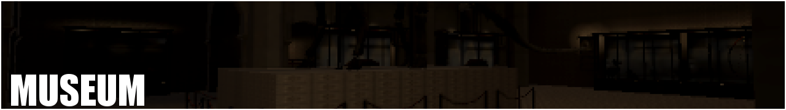

###### BOOT SEQ 00.14  ::  READ_Req: README.md ⠀⠀⠀⠀⠀⠀⠀⠀⠀⠀⠀⠀⠀⠀⠀⠀⠀⠀⠀⠀--⠀(For best formatting, please view this portfolio on desktop)

######  —⠀————————————————————————————————————————————⠀———⠀—

######  ⠀∙⠀TARGET USER:⠀∙⠀∙⠀∙⠀∙⠀∙⠀∙⠀∙⠀∙⠀∙⠀∙⠀∙⠀∙⠀∙⠀∙⠀HARIIIY

######  ⠀∙⠀ACCESS:⠀∙⠀∙⠀∙⠀∙⠀∙⠀∙⠀∙⠀∙⠀∙⠀∙⠀∙⠀∙⠀∙⠀∙⠀∙⠀∙⠀∙⠀TRUE

⣀⣀⣀⣤⣶⣿⣿⣶⣤⣀⣤⣤⣀⣀⣤⣶⣿⣶⣤⣀⣀⣀⣤⣀⣤⣶⣤⣀⣀⣀⣀⣀⣤⣶⣿⣶⣤⣀⣀⣀⣀⣀⣤⣶⣤⣀⣤⣤⣀⣀⣤⣶⣿⣶⣤⣀⣀⣶⣤⣀⣤⣤⣀⣀⣤⣶⣶⣤⣀⣀⣀

██████╗⠀⠀██████╗⠀⠀██████╗⠀⠀████████╗███████╗██████╗⠀⠀⠀██╗⠀⠀⠀⠀⠀██╗⠀██████╗
██╔══██╗██╔═══██╗⠀██╔══██╗╚══██╔══╝██╔════╝██╔═══██╗⠀██║⠀⠀⠀⠀⠀██║██╔═══██╗
██████╔╝██║⠀⠀⠀██║⠀██████╔╝⠀⠀⠀██║⠀⠀⠀⠀█████╗⠀⠀██║⠀⠀⠀██║⠀██║⠀⠀⠀⠀⠀██║ ██║⠀⠀⠀██║
██╔═══╝⠀██║⠀⠀⠀██║⠀██╔══██╗⠀⠀⠀██║⠀⠀⠀⠀██╔══╝⠀⠀██║⠀⠀⠀██║⠀██║⠀⠀⠀⠀⠀██║ ██║⠀⠀⠀██║
██║⠀⠀⠀⠀⠀╚██████╔╝⠀██║⠀⠀⠀██║⠀⠀██║⠀⠀⠀⠀██║⠀⠀⠀⠀⠀╚██████╔╝⠀███████╗██║ ╚██████╔╝
╚═╝⠀⠀⠀⠀⠀⠀╚═════╝⠀⠀╚═╝⠀⠀╚═╝⠀⠀⠀╚═╝⠀⠀⠀⠀╚═╝⠀⠀⠀⠀⠀⠀╚═════╝⠀⠀╚══════╝╚═╝ ╚═════╝

###### [ LOADING READY ] : SYSLOG || PROFILE

######  —⠀————————————————————————————————————————————⠀———⠀—

###### ▼⠀⠀▼ ⠀⠀ SCROLL TO CONTINUE

 

# Hi there, I'm Hariiiy!

>**Gameplay Programming / Designing / Digital Crafting**

<a href = "https://drive.google.com/file/d/1VxsYnEN6NGWPpP4SIrWFf6F1OKyMd8qk/view?usp=drive_link"> Games Preview [Video]  </a>
  ####  ::⠀"Work with game engines as creative tools, focusing on systems, interaction, and playable structures." 
  ####  ::⠀"Create games as a medium to translate personal ideas into systems, interactions, and experiences others can feel."

###### ▼⠀⠀▼ ⠀⠀ SCROLL TO CONTINUE

 

<b>Languages</b>

    
  
  
  
  
  

<b>Engine</b>

    
  

<b>Version Control</b>

    

 

## SYSTEMS & PROGRAMMING

>⠀**⠀This section presents gameplay systems, tools, and technical implementations. The focus is on structure, logic, and refinement through development.**

More

<!-- ================================================================================================================================Programming Part============================================================================================================================= -->
（...）
<!-- ================================================================================================================================Programming Part End============================================================================================================================= -->

 

## PROJECT

>⠀**⠀This section presents completed and ongoing projects where visual design, systems, and ideas converge into playable experiences.**

<!-- ================================================================================================================================The Sunset============================================================================================================================= -->

  
#### <b>The Sunset</b> 

 

  >『A world after collapse, where civilization fades and people search for meaning in what remains. Even without a promised future, the effort to move forward becomes proof of existence.』⠀⠀[Click to Open]

  >
[Roguelite]⠀⠀[CRPG-Inspired]⠀⠀[mixing 2D&3D]⠀⠀[Cards]⠀⠀[SOLO Project]

 

###### The Sunset is a mid-scale independent project developed solo. Players awaken with no memories in a world shaped by fungal collapse, gradually uncovering both the truth behind the apocalypse and their own origins. Rather than assuming a predefined role, players are invited to role-play themselves, making choices that define a personal journey through the world.

  

<b>Role</b>

<b>Solo Game Developer</b>

 >
Overview: As the sole developer of this project, I am responsible for every part of game creation, from initial concepts to final implementation. Including programming, art and animation, level design, sound design, and functions testing.

- **Programming:** Implemented game logic, physics, and user interfaces using Unity 3D and C#
- **2D Art and Animation:** Created character designs, environments, and characters' rigging animations using Adobe Photoshop, Sai2, Spine.
- **SFX:** Created Sound and background music with FL studio, Some source from: Artlist.io

<b>Technology Stack</b>
 
| Category          | Technologies               |
|-------------------|----------------------------|
| Engine            | Unity 3D                   |
| Programming       | C#                         |
| Version Control   | Git, GitHub                |
| Art and Design    | Adobe Photoshop, Spine, Sai 2     |
| Sound             | FL Studio                  |

 

<b>Coding highLight</b>

 

- **Save System:** Using .json files to save player's game data, Save Manager code with Singleton and Prototype, and can be called to save and load when needed by any game object script in the game.
- **Scriptable Objects:** Using scriptable objects to store perks' data, laying the foundation for adding more perks in future versions, making the perks better managed and making their mechanisms more diverse.
- **Object Pool:** Enemies are stored in a object pool, saving resources needed to generate each enemy and reducing the resources consumed by the monster group. Also preparing for future shooting mods character.

 

<b>Key Challenges and Solutions</b>

|Challenges       | Solutions             |
|-------------------|----------------------------|
| High perk count leads to loading delays        | Seprate the perk pool acooding to the perk type. Split the index numbers and assign meaning to each number,『Compared to 10001, 10002... Using a index to 13042, 1 represents the category of the perk, 3 represents the perk level, and 042 is the perk of the 42nd effect in category 1.』 This organization reduces the number of perks the system needs to search through, enhancing efficiency and minimizing resource consumption.  |
|Latin fonts lack Unicode support for certain languages       | Developed a manager script that searches for all in-game text upon startup or when the language setting is changed. This script automatically updates the text to use a stylized font that supports the selected language.          |

 

<b>Screen Shots</b>

 

---
<!-- ================================================================================================================================The Sunset============================================================================================================================= -->

<!-- ================================================================================================================================Restaurant Full Moon============================================================================================================================= -->

  
  #### <b>Restaurant Full Moon</b> 

 

  >『Serving customers by day, taking out the trash by night — being a werewolf doesn't exempt you from work :( 』⠀⠀[Click to Open]

  >
[Tycoon]⠀⠀[Simulation]⠀⠀[mixing 2D&3D]⠀⠀[Team Project]

<a href = "https://itch.io/jam/game-off-2024/rate/3147780"> Itch.io </a>

<b>Role</b>

<b>Programmer, Designer</b>

- **Programming:** Implemented Fishing Function and the interaction between player and fishes.
- **Visual:** Created the Water body effect with shader; numbers of particle effects.
- **Spawner** Method to randomly spawn fished and respawn after a catch.

<b>Technology Stack</b>
 
| Category          | Technologies               |
|-------------------|----------------------------|
| Engine            | Unreal 5                   |
| Programming       | Unreal BluePrint           |
| Version Control   | Git, GitHub                |

 

<b>Screen Shots</b>

 

---
<!-- ================================================================================================================================Restaurant Full Moon============================================================================================================================= -->
<!-- ================================================================================================================================Fishin!============================================================================================================================= -->

  
  #### <b>Fishin!</b> 

 

  >『Everything will seem peaceful until the secret is discovered. Fish, store, sell, and upgrade!』⠀⠀[Click to Open]

  >
 [Fishing]⠀⠀[3D Top Down]⠀⠀[Relax]⠀⠀[Team Project]

<a href = "https://itch.io/jam/game-off-2024/rate/3147780"> Itch.io </a>

<b>Role</b>

<b>Programmer, Designer</b>

- **Programming:** Implemented Fishing Function and the interaction between player and fishes.
- **Visual:** Created the Water body effect with shader; numbers of particle effects.
- **Spawner** Method to randomly spawn fished and respawn after a catch.

<b>Technology Stack</b>
 
| Category          | Technologies               |
|-------------------|----------------------------|
| Engine            | Unreal 5                   |
| Programming       | Unreal BluePrint           |
| Version Control   | Git, GitHub                |

 

<b>Screen Shots</b>

 

---
<!-- ================================================================================================================================Fishin!============================================================================================================================= -->
<!-- ================================================================================================================================Neon Paradox============================================================================================================================= -->

  
  #### <b>Neon Paradox</b> 

 

  >『"Gunfire, cybernetic augmentation, and an endless fight against a city overtaken by machines."』⠀⠀[Click to Open]

   >
[Rougelite]⠀⠀[FPS]⠀⠀[3D]⠀⠀[Team Project]

<a href = ""> Repo </a>

<b>Role</b>

<b>Programmer, Designer, Animator</b>

- **Programming:** Buff system, player movement, shooting and physical bullets, enemy spawing.
- **3D animation and Visual:** Particle effect for explosion effects, bullet effects, scene light baking，3D animation for weapon.

<b>Technology Stack</b>
 
| Category          | Technologies               |
|-------------------|----------------------------|
| Engine            | Unity                      |
| Programming       | C#                         |
| Version Control   | Git, GitHub                |

 

<b>HighLight</b>

 

- **3D Animation and Blend Trees:** Use Unity's keyframes to craft detailed 3D animations for character hands and weapons, animation set of actions and transitions such as shooting, reloading, and running.
- **Bullet and Shooting experience:** Bullets employ Rigidbody to simulate realistic trajectories, ejecting from the muzzle and gradually descending to the ground. Since each bullet is a GameObject with a Rigidbody component, an object pool is use to reduces the resource use caused by directly generating new bullets.
- **Buff System:** Players can choose different Buff effects to strengthen themselves in the game. Buffs of the same type will also provide combo effects.
 

<b>Screen Shots</b>

 

---
<!-- ================================================================================================================================Neon Paradox============================================================================================================================= -->
<!-- ================================================================================================================================Hunter============================================================================================================================= -->

  
  #### <b>Hunter</b> 

 

  >『"Firearms, rusted machinery, and the quiet tension of a western frontier."』⠀⠀[Click to Open]

   >
[3D Model]⠀⠀[Maya]⠀⠀[SOLO Project]

<a href = ""> Repo </a>

<b>Role</b>

<b>Programmer, Designer, Animator</b>

- **Programming:** Buff system, player movement, shooting and physical bullets, enemy spawing.
- **3D animation and Visual:** Particle effect for explosion effects, bullet effects, scene light baking，3D animation for weapon.

<b>Technology Stack</b>
 
| Category          | Technologies               |
|-------------------|----------------------------|
| Engine            | Unity                      |
| Programming       | C#                         |
| Version Control   | Git, GitHub                |

 

<b>HighLight</b>

 

- **3D Animation and Blend Trees:** Use Unity's keyframes to craft detailed 3D animations for character hands and weapons, animation set of actions and transitions such as shooting, reloading, and running.
- **Bullet and Shooting experience:** Bullets employ Rigidbody to simulate realistic trajectories, ejecting from the muzzle and gradually descending to the ground. Since each bullet is a GameObject with a Rigidbody component, an object pool is use to reduces the resource use caused by directly generating new bullets.
- **Buff System:** Players can choose different Buff effects to strengthen themselves in the game. Buffs of the same type will also provide combo effects.
 

<b>Screen Shots</b>

 

---
<!-- ================================================================================================================================Hunter============================================================================================================================= -->
<!-- ================================================================================================================================Museum============================================================================================================================= -->

  
#### <b>Museum</b> 

 

>『"I was assigned to the night shift at a museum — but something keeps moving in the corridors after midnight."』⠀⠀[Click to Open]

   >
[Horror]⠀⠀[Puzzle]⠀⠀[3D Stylization]⠀⠀[Team Project]

   
<video src="image/MuseumGamePreview.mp4" width="720" autoplay loop muted playsinline></video>

<b>Role</b>

> <b>Designer, Programmer, Technical Art</b>

- **Programming:** Character movement and camera swing, interactive system, and level puzzle.
- **Visual:** Using the rendering image as a lens filter and baking lighting effects for the levels.

<b>Technology Stack</b>
 
| Category          | Technologies               |
|-------------------|----------------------------|
| Engine            | Unity                      |
| Programming       | C#                         |
| Version Control   | Git, GitHub                |

 

<b>Screen Shots</b>

 

---
<!-- ================================================================================================================================Museum============================================================================================================================= -->
<!-- ================================================================================================================================Forest============================================================================================================================= -->

  
  #### <b>Forest</b> 

 

  
  >『"As a warrior, you need to survive in this dangerous environment and defeat the enemy." A simple adventure game built entirely with text characters in a console environment.』⠀⠀[Click to Open]

  >
[Systems Design]⠀⠀[RPG]⠀⠀[Text-Based]⠀⠀[SOLO Project]

 

###### Forest is my first formal game project, developed for an OOP course. Without access to a game engine or graphical support, players and enemies can only represented through abstract character symbols. 

 

<b>Role</b>

> <b>Programmer</b>

- **Systems Design:** A text-based adventure game built in a console environment, recreating classic RPG mechanics through character symbols replacement.
- **Random Generation:** Randomly generated safe houses and monster lairs, including different terrains. A monster nest will continue to generate enemy.
- **Env:** Dangerous terrain that can hurt player; walls, trees, and stones block the player's movements.
- **Battle** Players can engage in turn-based combat with enemies by approach them.

 

> <b>Technology Stack</b>
 
| Category          | Technologies               |
|-------------------|----------------------------|
| Platform          | Visual Studio Console (C#) |

 

> Due to the age of the project, the original playable build and screenshots are no longer fully accessible.

---
<!-- ================================================================================================================================Forest============================================================================================================================= -->

  
  #### <b>The Two Worlds</b> 

  >『A small group-developed puzzle and action game created during a high school after-school program for the Youth Fusion. The project follows a child from opposing worlds who progress through puzzles and combat to defeat a final boss. 』⠀⠀[Click to Open]

 >
[Puzzle]⠀⠀[Adventure]⠀⠀[2D]⠀⠀[Team Project]

<a href = "https://fusionjeunesse.org/jeuxvideo_files/18-19/Canada/MontrealEtPeripherie/S/Rosemont/TheTwoWorlds/Jeu"> Youth Fusion 2018-2019 edition</a>

 

  

<b>Role</b>

> <b>Programmer, Artist</b>

- **Programming:** 2D shooting method and interactive puzzles
- **Art:** Scene and NPC's sprites

> <b>Technology Stack</b>
 
| Category          | Technologies               |
|-------------------|----------------------------|
| Game Engine            | Construct 3                |
| Art            | Aseprite               |

 

> Due to the age of the project, the original playable build and screenshots are no longer fully accessible.

---

