###### BOOT SEQ 00.14  ::  READ_Req: README.md ⠀⠀⠀⠀⠀⠀⠀⠀⠀⠀⠀⠀⠀⠀⠀⠀⠀⠀⠀⠀--⠀(For best formatting, please view this portfolio on desktop)

######  —⠀————————————————————————————————————————————⠀———⠀—

######  ⠀∙⠀TARGET USER:⠀∙⠀∙⠀∙⠀∙⠀∙⠀∙⠀∙⠀∙⠀∙⠀∙⠀∙⠀∙⠀∙⠀∙⠀HARIIIY

######  ⠀∙⠀ACCESS:⠀∙⠀∙⠀∙⠀∙⠀∙⠀∙⠀∙⠀∙⠀∙⠀∙⠀∙⠀∙⠀∙⠀∙⠀∙⠀∙⠀∙⠀TRUE

⣀⣀⣀⣤⣶⣿⣿⣶⣤⣀⣤⣤⣀⣀⣤⣶⣿⣶⣤⣀⣀⣀⣤⣀⣤⣶⣤⣀⣀⣀⣀⣀⣤⣶⣿⣶⣤⣀⣀⣀⣀⣀⣤⣶⣤⣀⣤⣤⣀⣀⣤⣶⣿⣶⣤⣀⣀⣶⣤⣀⣤⣤⣀⣀⣤⣶⣶⣤⣀⣀⣀

██████╗⠀⠀██████╗⠀⠀██████╗⠀⠀████████╗███████╗██████╗⠀⠀⠀██╗⠀⠀⠀⠀⠀██╗⠀██████╗
██╔══██╗██╔═══██╗⠀██╔══██╗╚══██╔══╝██╔════╝██╔═══██╗⠀██║⠀⠀⠀⠀⠀██║██╔═══██╗
██████╔╝██║⠀⠀⠀██║⠀██████╔╝⠀⠀⠀██║⠀⠀⠀⠀█████╗⠀⠀██║⠀⠀⠀██║⠀██║⠀⠀⠀⠀⠀██║ ██║⠀⠀⠀██║
██╔═══╝⠀██║⠀⠀⠀██║⠀██╔══██╗⠀⠀⠀██║⠀⠀⠀⠀██╔══╝⠀⠀██║⠀⠀⠀██║⠀██║⠀⠀⠀⠀⠀██║ ██║⠀⠀⠀██║
██║⠀⠀⠀⠀⠀╚██████╔╝⠀██║⠀⠀⠀██║⠀⠀██║⠀⠀⠀⠀██║⠀⠀⠀⠀⠀╚██████╔╝⠀███████╗██║ ╚██████╔╝
╚═╝⠀⠀⠀⠀⠀⠀╚═════╝⠀⠀╚═╝⠀⠀╚═╝⠀⠀⠀╚═╝⠀⠀⠀⠀╚═╝⠀⠀⠀⠀⠀⠀╚═════╝⠀⠀╚══════╝╚═╝ ╚═════╝

###### [ LOADING READY ] : SYSLOG || PROFILE

######  —⠀————————————————————————————————————————————⠀———⠀—

###### ▼⠀⠀▼ ⠀⠀ SCROLL TO CONTINUE

 

# Hi there, I'm Hariiiy!

>**Gameplay Programming / Designing / Digital Crafting**

<a href = "https://drive.google.com/file/d/1VxsYnEN6NGWPpP4SIrWFf6F1OKyMd8qk/view?usp=drive_link"> Games Preview [Video]  </a>
  ####  ::⠀"Work with game engines as creative tools, focusing on systems, interaction, and playable structures." 
  ####  ::⠀"Create games as a medium to translate personal ideas into systems, interactions, and experiences others can feel."

###### ▼⠀⠀▼ ⠀⠀ SCROLL TO CONTINUE

 

<b>Languages</b>

    
  
  
  
  
  

<b>Engine</b>

    
  

<b>Version Control</b>

    

 

## Technical Documentation

>⠀**⠀This section presents Technical documentation for individual projects: including design concepts, system code, etc.**

More

<!-- ================================================================================================================================Programming Part============================================================================================================================= -->
（...）
<!-- ================================================================================================================================Programming Part End============================================================================================================================= -->

 

## PROJECT

>⠀**⠀This section presents completed and ongoing projects where visual design, systems, and ideas converge into playable experiences.**

<!-- ================================================================================================================================The Sunset============================================================================================================================= -->

  
#### <b>The Sunset [Ongoing]</b> 

 

  >『A world after collapse, where civilization fades and people search for meaning in what remains. Even without a promised future, the effort to move forward becomes proof of existence.』⠀⠀[Click to Open]

  >
[Roguelite]⠀⠀[CRPG-Inspired]⠀⠀[mixing 2D&3D]⠀⠀[Cards]⠀⠀[SOLO Project]

[▶ Full HD Preview](image/TheSunset/TheSunset_Preview.mp4)

 

###### You wake up with a splitting headache, your thoughts scattered and incomplete. All around you are ruins — twisted metal, collapsing structures, and fungal growth consuming what remains of the world.

###### Searching for answers about your identity and the cause of the world’s collapse, you unexpectedly connect to a private channel.

###### At the other end lies a massive offshore oil platform, isolated in the depths of the sea.

###### Who is still alive there? And what mark will you leave on this dying world?

 

<b>Role</b>

 

> <b>Game Director, Programmer, Artist</b>

- **Narrative System:** `Designed a text-heavy narrative structure centered on world state rather than player progression, using environmental records, side characters, and documents to establish a background world view.`
  
- **Roguelite Exploration System:** `Implemented a roguelike exploration loop where players can change map tiles during exploration, allowing the environment itself to become part of strategic decision-making.`
  
- **Dice-based Randomness (DND-inspired):** `Integrated DND-style dice rolls into combat and exploration, including event-based checks during exploration, introducing controlled randomness that affects a event outcomes, rewards, and player decision-making beyond combat scenarios.`

- **Buff & Modifier System:** `Built a scalable system to manage randomized buffs and modifiers for battle system, enabling long-term addon in future update.`

- **Art Direction & UI, UX:** `Developed a unified visual direction combining ruins and vegetation, industrial signage-inspired UI, and a disc-based chapter selection system, which is inspired by archival media and music albums.`

 

> <b>Technology Stack</b>
 
| Category          | Technologies               |
|-------------------|----------------------------|
| Engine⠀⠀⠀⠀⠀            | Unity⠀⠀⠀⠀⠀                   |
| Programming⠀⠀⠀⠀⠀       | C#⠀⠀⠀⠀⠀                         |
| Art⠀⠀⠀⠀⠀    |Photoshop, Spine, SAI Ver.2⠀⠀⠀⠀⠀⠀    |
| Sound⠀⠀⠀⠀⠀             | FL Studio⠀⠀⠀⠀⠀                  |

 

<b>Visual Tone & Gameplay Screenshot</b>

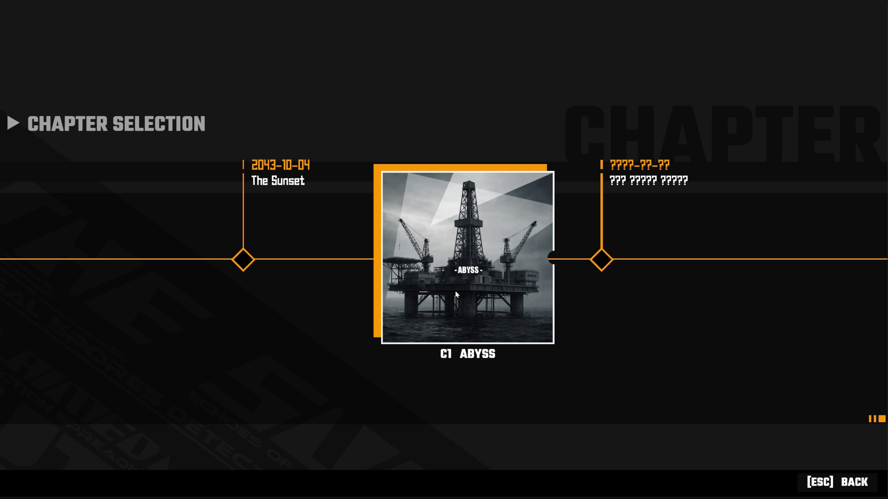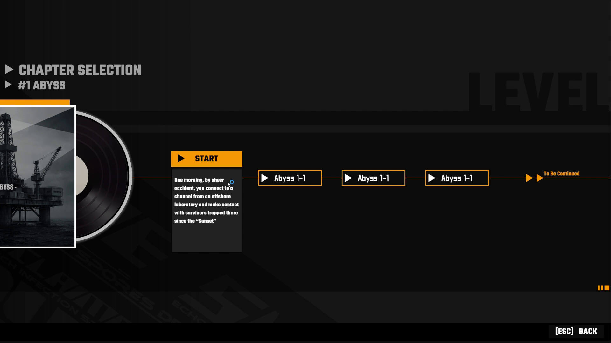

 

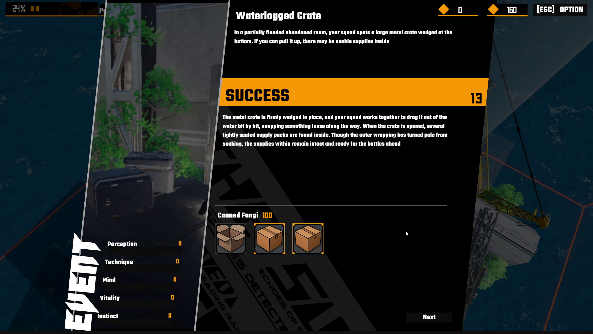

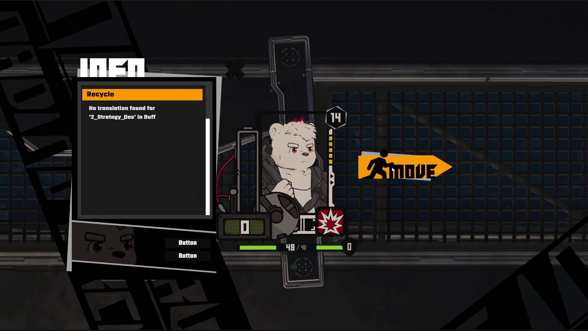
 

---
<!-- ================================================================================================================================The Sunset============================================================================================================================= -->

<!-- ================================================================================================================================Restaurant Full Moon============================================================================================================================= -->

  
  #### <b>Restaurant Full Moon</b> 

 

  >『Serving customers by day, taking out the trash by night — being a werewolf doesn't exempt you from work :( 』⠀⠀[Click to Open]

  >
[Tycoon]⠀⠀[Simulation]⠀⠀[mixing 2D&3D]⠀⠀[Team Project]

 

###### By day, you run a burger restaurant. Serve customers, complete orders, and pay the rent.

###### By night, you’re a werewolf. Take out the trash, stay out of sight — and make sure no one reports what they shouldn’t have seen.

###### Keep the secret. Tomorrow’s business depends on it.

###### (Inspired by WereCleaner, with character concepts and themes adapted as a stylistic homage)

 

<b>Role</b>

 

> <b>Designer, Programmer, Artist</b>

- **Gameplay:** Designed the core night-time mechanic built around pickup, charge, and throw interactions. This system defines how players interacte with objects or characters during the night phase, it also introduces stealth gameplay and risk management.
  
- **Art:** Created character sprites for the protagonist, civilians, and environmental objects. Implemented animations using Unity’s Animator to enhance interactions, and add extra "juice" feel to gameplay.
  
- **Narrative Visual Design:** Designed a set of in-game newspaper pages representing different endings. Each failure condition triggers a unique newspaper, using visual storytelling to reflect consequences cause by what player did.

 

> <b>Technology Stack</b>
 
| Category          | Technologies               |
|-------------------|----------------------------|
| Engine⠀⠀⠀⠀⠀            | Unity⠀⠀⠀⠀⠀                |
| Programming⠀⠀⠀⠀⠀       | C#⠀⠀⠀⠀⠀          |
| Art⠀⠀⠀⠀⠀  | SAI Ver.2⠀⠀⠀⠀⠀              |

 

<b>Visual Tone & Gameplay Screenshot</b>

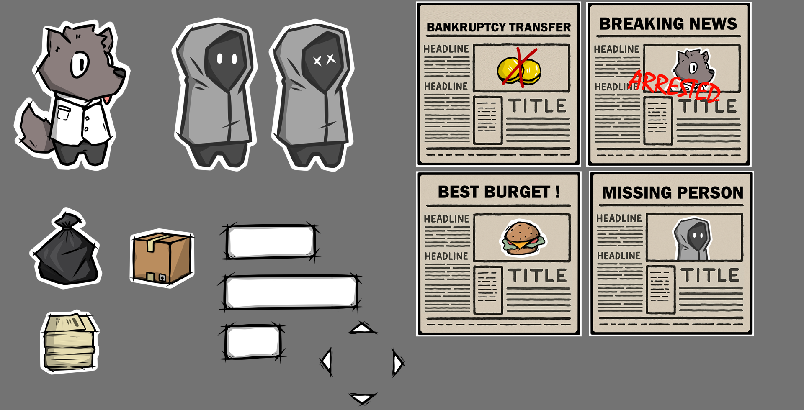 

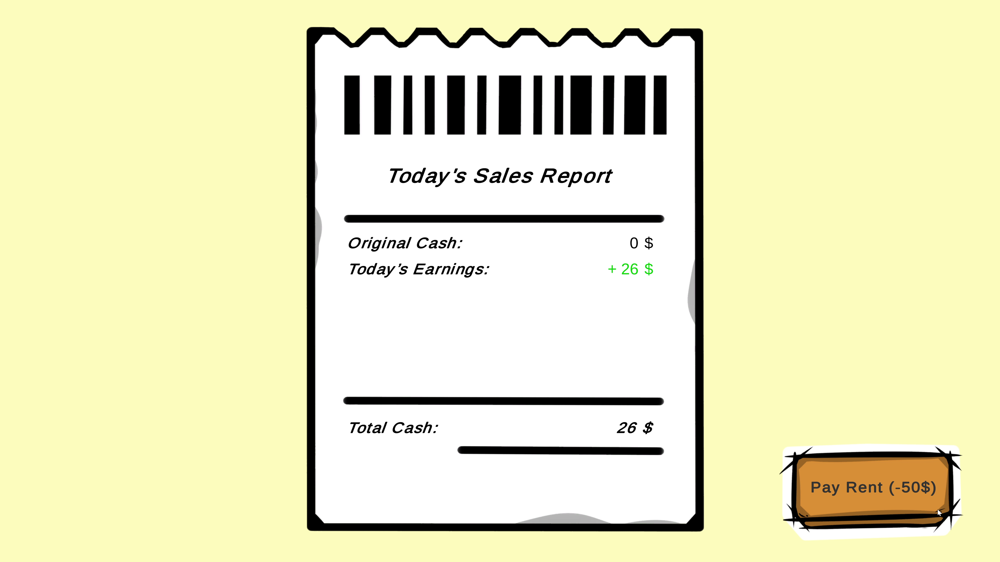

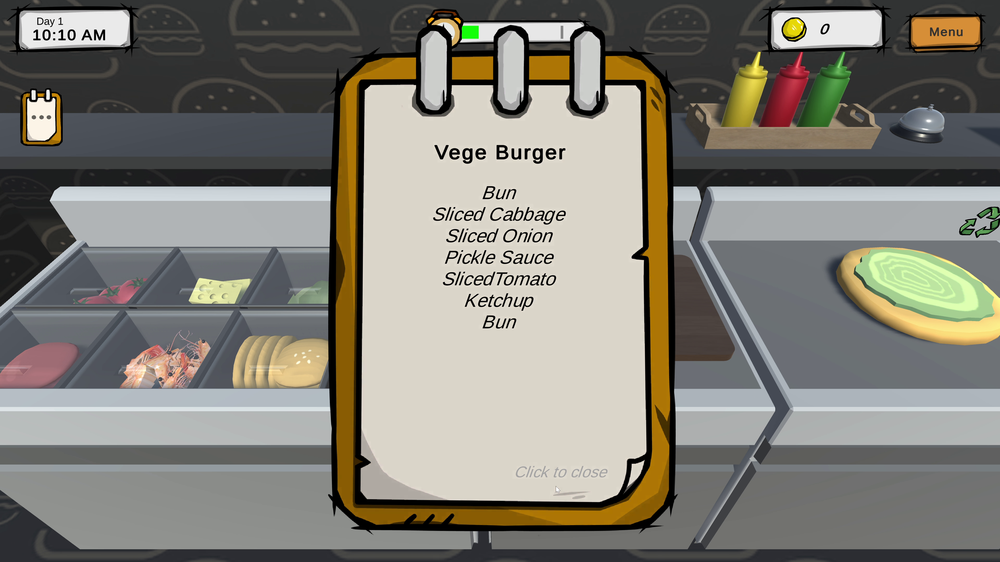 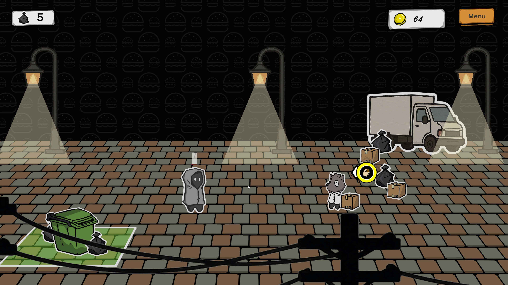
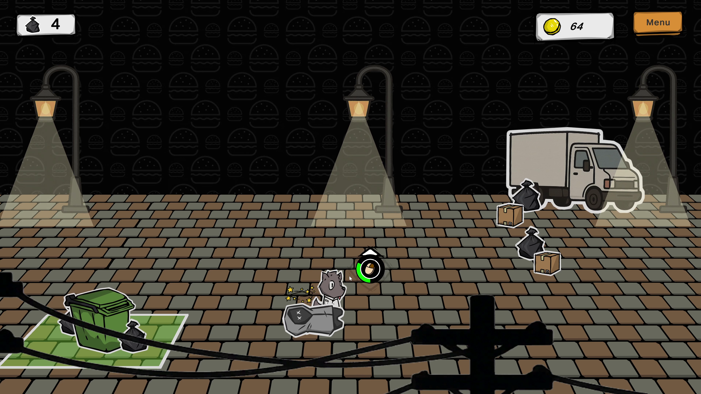
 

---
<!-- ================================================================================================================================Restaurant Full Moon============================================================================================================================= -->
<!-- ================================================================================================================================Fishin!============================================================================================================================= -->

  
  #### <b>Fishin!</b>⠀⠀⠀  <a href = "https://itch.io/jam/game-off-2024/rate/3147780"> 『Itch.io Game Off 2024』 </a>

 

  >『Everything will seem peaceful until the secret is discovered. Fish, store, sell, and upgrade!』⠀⠀[Click to Open]

  >
 [Fishing]⠀⠀[Relax]⠀⠀[3D Top Down]⠀⠀[Team Project]

 

###### You wake up on a small boat in unfamiliar waters. The sea is red, the fog is hot, and the fish don’t look right — but the line still holds, and the water is full of them.

###### So you fish, Catch, sell, upgrade your gear, and reach deeper waters where stranger, heavier fish wait.

###### Whatever this place is can wait. As long as there are fish, there’s work to do.

 

<b>Role</b>

 

> <b>Programmer, Technical Artist</b>

- **Gameplay:** `Designed and implemented the core fishing QTE system, serving as the primary gameplay loop. Fish are procedurally generated with varying difficulty, behavior, and value, encouraging progression through gear upgrades.`
  
- **Visual Effects:** `Created the water surface shader to simulate ripples and disturbances caused by the player’s boat and fish movement. Developed particle effects for fog as a airwall, also to reinforce the unsettling atmosphere of the environment.`

 

> <b>Technology Stack</b>
 
| Category          | Technologies               |
|-------------------|----------------------------|
| Engine⠀⠀⠀⠀⠀            | Unreal 5⠀⠀⠀⠀⠀                   |
| Programming⠀⠀⠀⠀⠀       | Unreal BluePrint & C++⠀⠀⠀⠀⠀          |

 

<b>Visual Tone & Gameplay Screenshot</b>

###### Fishing (.gif might take time to load)

###### Screenshot

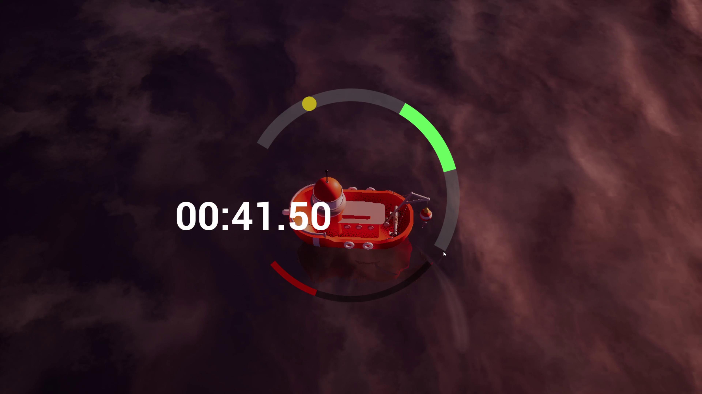 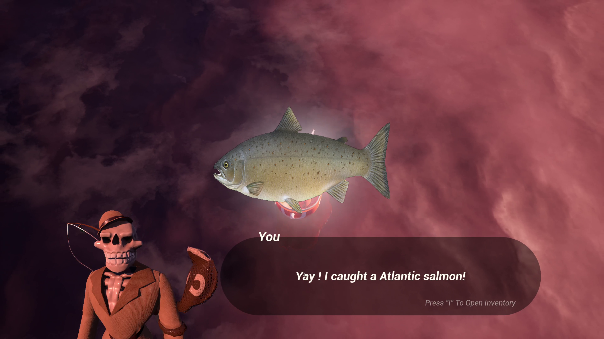

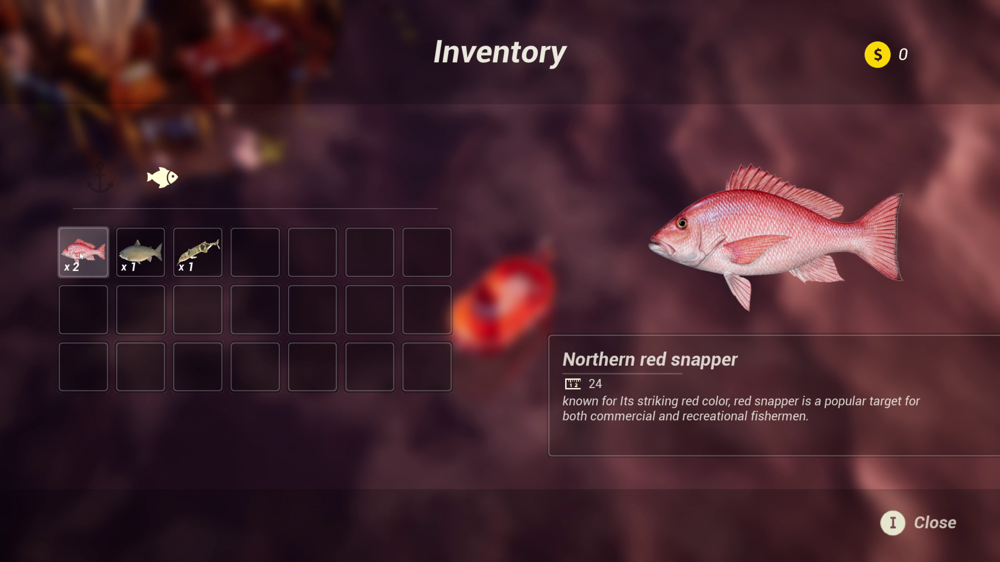 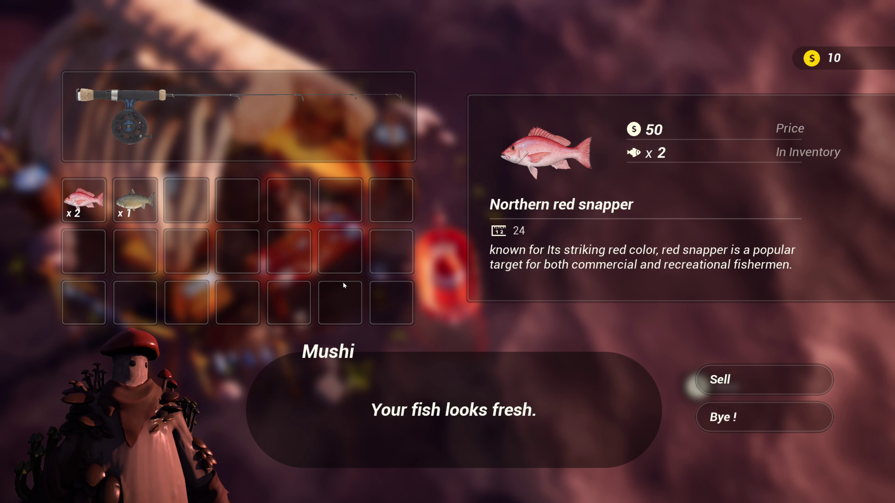
 

---
<!-- ================================================================================================================================Fishin!============================================================================================================================= -->
<!-- ================================================================================================================================Neon Paradox============================================================================================================================= -->

  
  #### <b>Neon Paradox</b> 

 

  >『"Gunfire, cybernetic augmentation, and an endless fight against a city overtaken by machines."』⠀⠀[Click to Open]

   >
[Rougelite]⠀⠀[FPS]⠀⠀[3D]⠀⠀[Team Project]

 

###### The city has been overtaken by machines. Don’t overthink it — grab your weapon, unleash everything you’ve got, and turn steel into scrap.

###### Install powerful buff chips to push your firepower, speed, and combat efficiency beyond human limits. Stack upgrades, break the flow of combat, and dominate the battlefield.

###### These chips were never meant to be safe. The side effects exist — just not where you’re forced to deal with them yet.

 

<b>Role</b>

 

> <b>Designer, Programmer, Technical Artist</b>

- **Gameplay:** `Designed the core roguelite buff system using buff pools and runtime selection. Buffs reshape both player stats and behavior, enabling shooting experience and high-mobility movement mechanics.`

- **Weapon Handling:** `Implemented a physics-driven shooting system using Rigidbody-based projectile simulation. Bullet spread and drop are simulated in real time and combined with camera recoil and weapon animation shake to create a grounded, responsive shooting experience.`
  
- **Animation & Visual:** `Created all first-person hand keyframe animations and built the animation state machine supporting weapons and high-mobility actions. Handled animation blending and particle effects to ensure visual feedback during player's state transitions.`

 

> <b>Technology Stack</b>
 
| Category          | Technologies               |
|-------------------|----------------------------|
| Engine⠀⠀⠀⠀⠀            | Unity⠀⠀⠀⠀⠀                      |
| Programming⠀⠀⠀⠀⠀       | C#⠀⠀⠀⠀⠀                         |

 

<b>Visual Tone & Gameplay Screenshot</b>

###### Gunplay animation (.gif might take time to load)

###### Movement animation (.gif might take time to load)

###### Screenshot

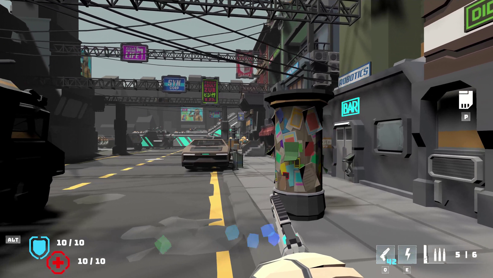 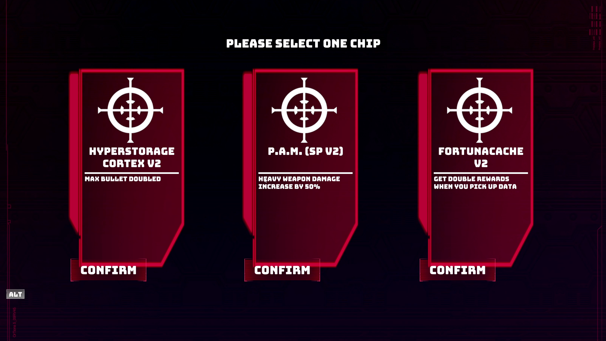

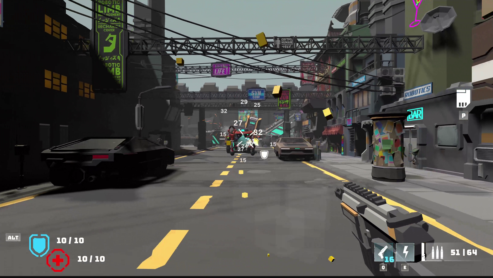 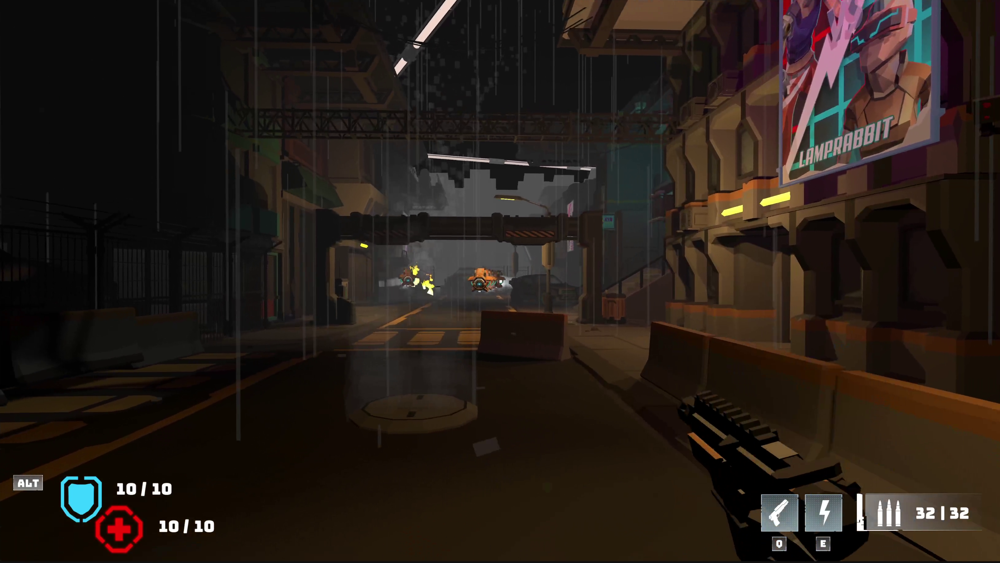

 

---
<!-- ================================================================================================================================Neon Paradox============================================================================================================================= -->
<!-- ================================================================================================================================Hunter============================================================================================================================= -->

  
  #### <b>Hunter</b> 

 

  >『"Firearms, rusted machinery, and the quiet tension of a western frontier."』⠀⠀[Click to Open]

   >
[3D Model]⠀⠀[Lighting]⠀⠀[Maya]⠀⠀[SOLO Project]

###### This project was created as a 3D modeling and lighting study using Maya and Unity.
###### Inspired by the western and swamp aesthetics of "Hunt: Showdown", the scene aims to display a hunter’s cabin hidden deep within the wetlands, captured during a quiet afternoon after the fog has lifted.

 

<b>Role</b>

 

> <b>Technical Artist</b>

- **Structural Focus:** `Firearm models was built with fully articulated internal firing mechanisms, including bolt operation, chamber structure, and rifling-related components.`
- **Animation & Rigging:** `The firearms' bolt cycling and ejection behavior were demonstrated using Maya joint system and Unity’s Animator, showing the mechanical linkage between internal components during operation.`
- **Lighting:** `Explored Unity’s native ray tracing features to construct natural lighting and shadow, focusing on material response, and environmental mood.`

 

><b>Technology Stack</b>
 
| Category          | Technologies               |
|-------------------|----------------------------|
| Engine⠀⠀⠀⠀⠀            | Unity⠀⠀⠀⠀⠀                      |
| 3D Modeling⠀⠀⠀⠀⠀⠀       | Maya⠀⠀⠀⠀⠀                         |

 

<b>High-Res Screenshot</b>

 

 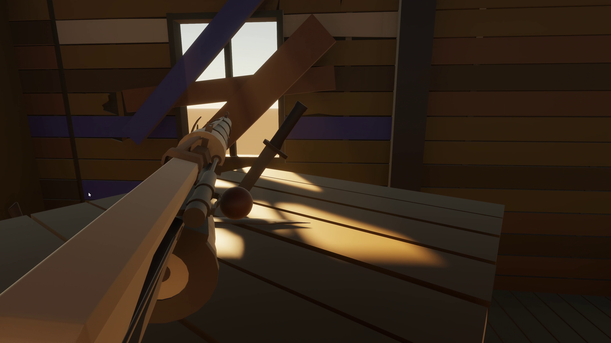
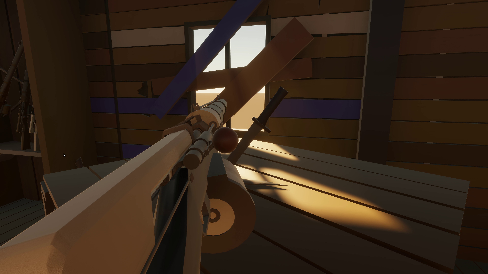 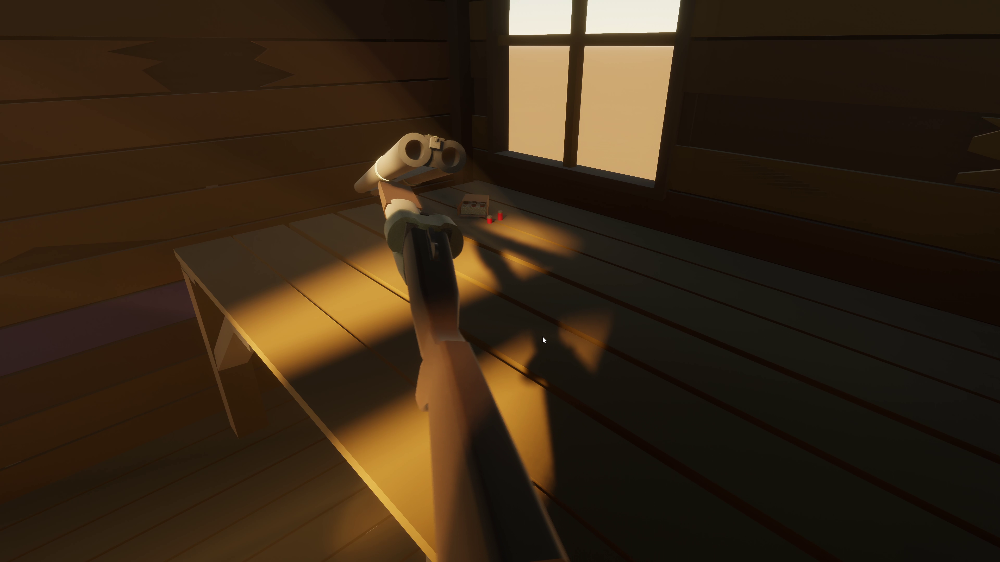
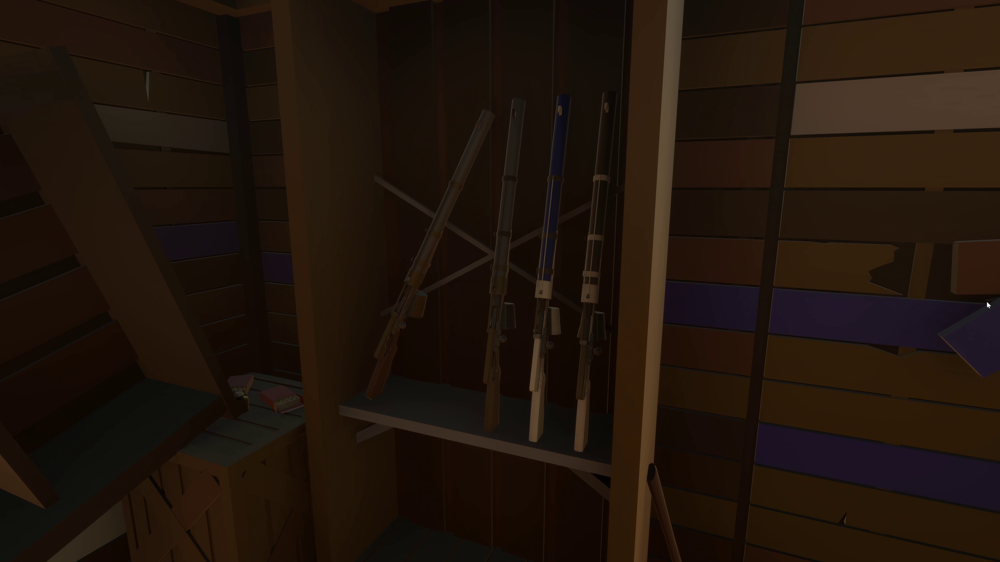 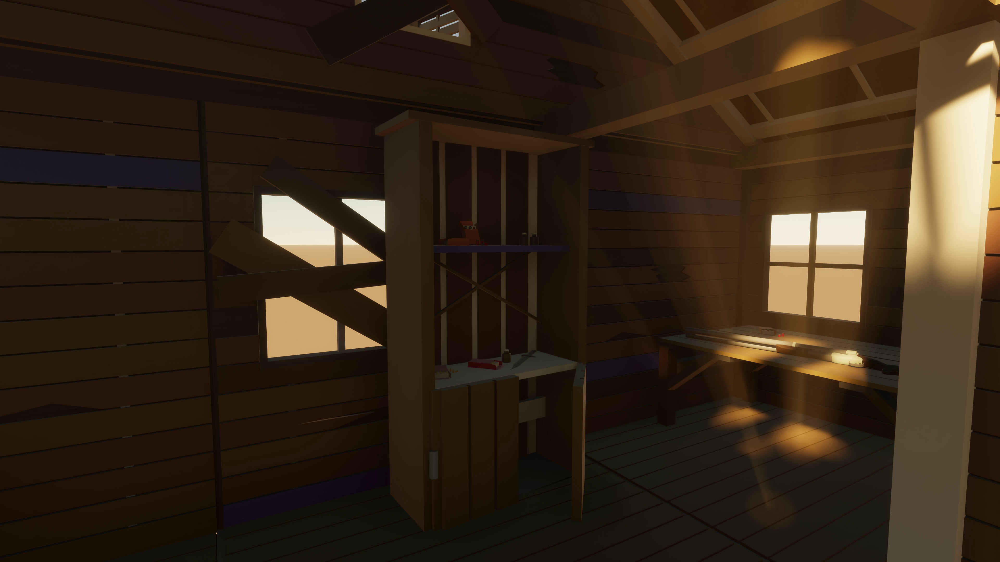
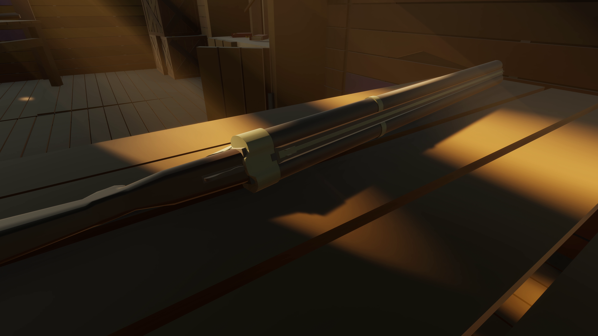 
 

---
<!-- ================================================================================================================================Hunter============================================================================================================================= -->
<!-- ================================================================================================================================Museum============================================================================================================================= -->

  
#### <b>Museum</b> 

 

>『"I was assigned to the night shift at a museum — but something keeps moving in the corridors after midnight."』⠀⠀[Click to Open]

   >
[Horror]⠀⠀[Puzzle]⠀⠀[3D Stylization]⠀⠀[Team Project]

   

###### A night security guard vanished inside a museum, leaving behind unanswered questions — and a highly paid vacant position.
###### Working alone after closing hours, players follow routine patrol notes, investigate strange noises, solve puzzles, and evade an unknown presence in order to survive the night and escape.

 

<b>Role</b>

 

> <b>Designer, Programmer, Technical Artist</b>

 

**Visual Choosing & Direction:** `Defined a unified visual language across environments, UI, and rendering choices to ensure stylistic consistency throughout the project.`

**Programming:** `Player control flow, interaction rules, and puzzle logic designed to support tension and pacing.`

**Visual:** `Pixel-based rendering and glitch effect used to unify low-detail assets and enhance atmosphere.`

  

 

> <b>Technology Stack</b>
 
| Category          | Technologies               |
|-------------------|----------------------------|
| Engine⠀⠀⠀⠀⠀            | Unity⠀⠀⠀⠀⠀                      |
| Programming⠀⠀⠀⠀⠀       | C#⠀⠀⠀⠀⠀                         ||

 

<b>Visual Tone & Gameplay Screenshot</b>

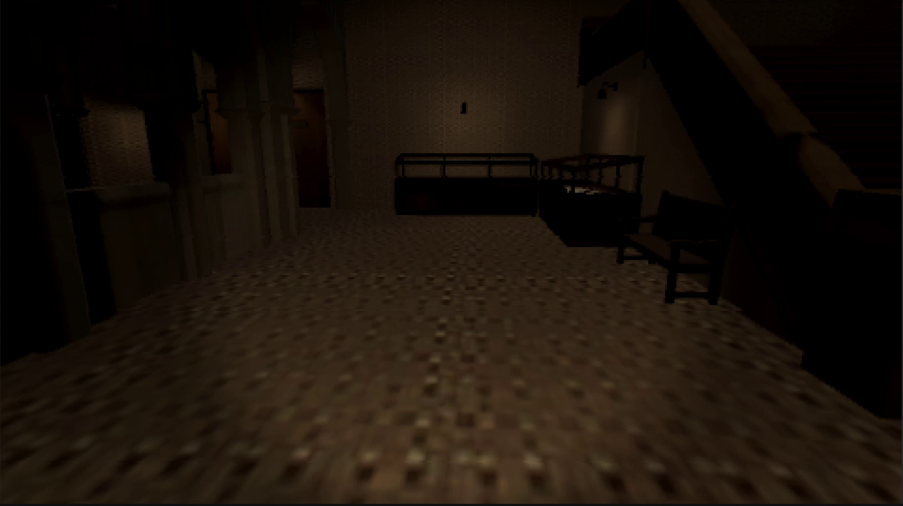 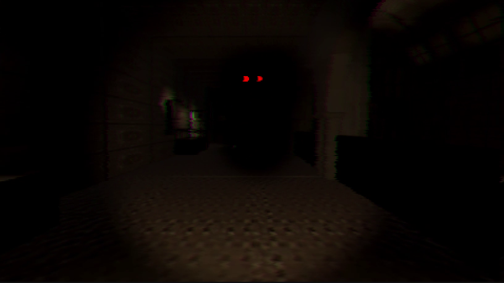

 

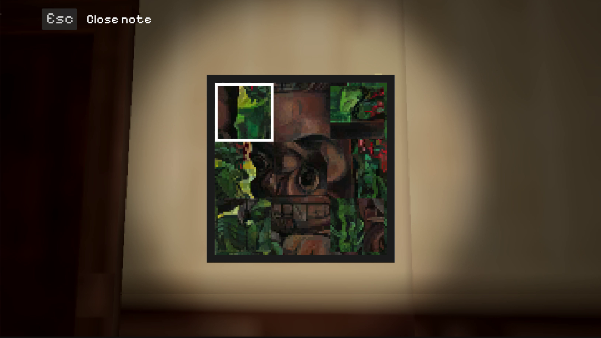
 

---
<!-- ================================================================================================================================Museum============================================================================================================================= -->
<!-- ================================================================================================================================Forest============================================================================================================================= -->

  
  #### <b>Forest</b> 

 

  
  >『"As a warrior, you need to survive in this dangerous environment and defeat the enemy." A simple adventure game built entirely with text characters in a console environment.』⠀⠀[Click to Open]

  >
[Systems Design]⠀⠀[RPG]⠀⠀[Text-Based]⠀⠀[SOLO Project]

 

###### Forest is my first formal game project, developed for an OOP course. Without access to a game engine or graphical support, players and enemies can only represented through abstract character symbols. 

 

<b>Role</b>

 

> <b>Programmer</b>

- **Systems Design:** `A text-based adventure game built in a console environment, recreating classic RPG mechanics through character symbols replacement.`
- **Random Generation:** `Randomly generated safe houses and monster lairs, including different terrains. A monster nest will continue to generate enemy.`
- **Env:** `Dangerous terrain that can hurt player; walls, trees, and stones block the player's movements.`
- **Battle:** `Players can engage in turn-based combat with enemies by approach them.`

 

> <b>Technology Stack</b>
 
| Category          | Technologies               |
|-------------------|----------------------------|
| Platform⠀⠀⠀⠀⠀          | Visual Studio Console (C#)⠀⠀⠀⠀⠀ |

 

> Due to the age of the project, the original playable build and screenshots are no longer fully accessible.

---
<!-- ================================================================================================================================Forest============================================================================================================================= -->

  
  #### <b>The Two Worlds</b>⠀⠀⠀    <a href = "https://fusionjeunesse.org/jeuxvideo_files/18-19/Canada/MontrealEtPeripherie/S/Rosemont/TheTwoWorlds/Jeu"> 『Youth Fusion 2018-2019 edition』</a>

  >『A small group-developed puzzle and action game created during a high school after-school program for the Youth Fusion. The project follows a child from opposing worlds who progress through puzzles and combat to defeat a final boss. 』⠀⠀[Click to Open]

 >
[Puzzle]⠀⠀[Adventure]⠀⠀[2D]⠀⠀[Team Project]

 

  

<b>Role</b>

 

> <b>Programmer, Artist</b>

- **Programming:** `2D shooting method and interactive puzzles.`
- **Art:** `Scene and NPC's sprites.`

 

> <b>Technology Stack</b>
 
| Category          | Technologies               |
|-------------------|----------------------------|
| Game Engine⠀⠀⠀⠀⠀           | Construct 3⠀⠀⠀⠀⠀                |
| Art⠀⠀⠀⠀⠀            | Aseprite⠀⠀⠀⠀⠀               |

 

> Due to the age of the project, the original playable build and screenshots are no longer fully accessible.

---

